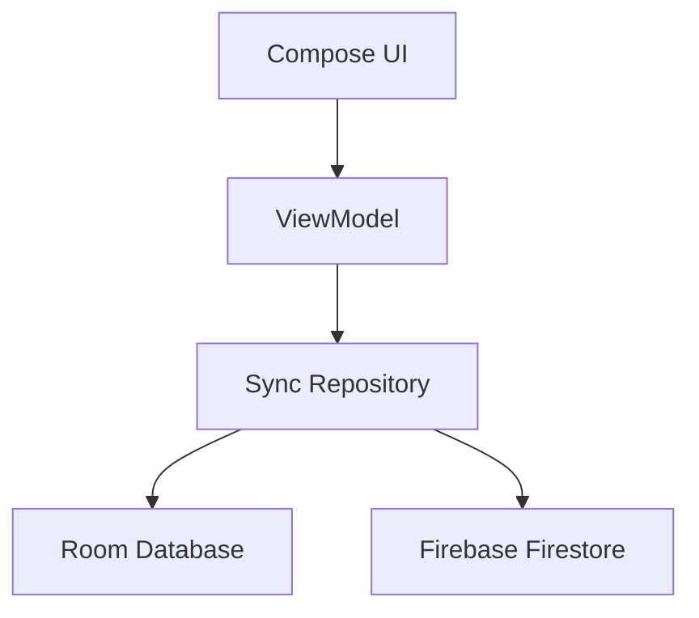

# Jobby 💼

**Jobby** is a modern, offline-first Android application designed to be your ultimate job search buddy. Built with Jetpack Compose and Firebase, it helps you organise your job hunt by tracking applications, interviews, and offers in one centralised place.


(originally, the sign the person holding in the app icon was "hire me plz" 😏)

## 🚀 Features

*   **Offline-First Architecture:** Your data is always accessible. View and edit your job applications even without an internet connection.
*   **Firebase Integration:** 
    *   **Authentication:** Secure login and sign-up using Firebase Email/Password.
    *   **Cloud Sync:** Optional real-time synchronisation between your local database (Room) and the cloud (Firestore).
*   **Offline Mode:** Start tracking jobs immediately without an account; your data will be saved locally.
*   **Comprehensive Tracking:** Manage detailed job information including:
    *   Job Title & Company
    *   Application Status (To Apply, Applied, Interview, Offered, etc.)
    *   Salary, Location, and Application URLs
    *   Contact Information & Custom Notes
*   **Modern UI:** A clean, reactive interface built entirely with **Jetpack Compose** and **Material 3**.

## 🛠 Tech Stack

*   **Language:** [Kotlin](https://kotlinlang.org/)
*   **UI:** [Jetpack Compose](https://developer.android.com/jetpack/compose) (Material 3)
*   **Database (Local):** [Room](https://developer.android.com/training/data-storage/room)

*   **Backend:** [Firebase](https://firebase.google.com/) (Auth, Firestore, Analytics)
*   **Architecture:** MVVM + Repository Pattern + Offline-First Sync Logic
*   **Navigation:** Jetpack Navigation Compose (Type-safe routes)
*   **Concurrency:** Kotlin Coroutines & Flow

## 🏗 Architecture

Jobby follows the **Offline-First** architecture. The UI always reads from the local Room database, ensuring the app is always fast and responsive. A "Sync" layer sits between the local and remote repositories, handling the logic of pushing updates to Firestore when a connection is available.



## 🏁 Getting Started

### Prerequisites
*   Android Studio Ladybug (or newer)
*   A Firebase Project

### Setup
1.  **Clone the repository:**
    ```bash
    git clone https://github.com/yourusername/JobbyApp.git
    ```
2.  **Add Firebase:**
    *   Create an Android app in your Firebase Console.
    *   Download the `google-services.json` and place it in the `app/` directory.
    *   Enable **Email/Password** and **Anonymous** Authentication in the Firebase Console.
    *   Enable **Cloud Firestore**.
3.  **Build & Run:**
    *   Sync Gradle and run the app on your emulator or physical device.
